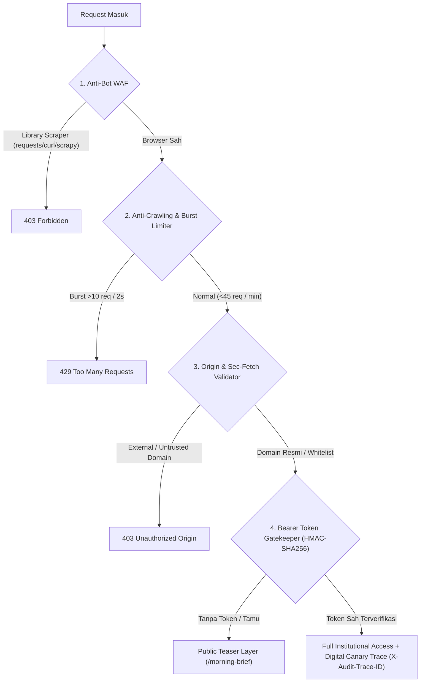

# 📈 Stock Market Recommendation: AI & Quant Platform

[](https://vercel.com/new/clone?repository-url=https%3A%2F%2Fgithub.com%2FIfan-Apres%2Fstock-market-recommendation)
[](https://stock-market-recommendation-silk.vercel.app)
[](https://github.com/Ifan-Apres/stock-market-recommendation)
[](https://www.python.org/)
[](https://opensource.org/licenses/MIT)

> **Platform Riset Ekuitas Institusional & Rekomendasi Saham Kuantitatif Berbasis Multi-Engine Machine Learning (GBDT + Macro-Aware PyTorch LSTM + ARIMA + GARCH), Scraper Resmi Arus Modal Asing BEI (IDX Foreign Flow), Analisis Fundamental Laporan Keuangan 5 Tahun + AI Archetypes (Gemini 3.8 Flash), dan Dynamic Universe Manager untuk Bursa Efek Indonesia (BEI / IDX).**  
> **Dikembangkan dan Dikelola oleh TIM New York: Ifan Apres & Sekar Widhastri.**

---

## 🌟 Ikhtisar Proyek (Project Overview)

**Stock Market Recommendation** adalah platform investasi saham dan riset kuantitatif tingkat institusional yang dirancang dengan antarmuka modern yang bersih, responsif, dan berbasis komputasi matematis presisi. Platform ini memadukan:
1. **Scraper Resmi Arus Modal Asing BEI (*IDX Foreign Flow Engine*)**: Mengambil langsung ringkasan perdagangan harian (*Trading Summary*) dari bursa resmi dengan impersonasi browser anti-Cloudflare, menghitung perputaran transaksi asing per saham hingga ke nominal Rupiah terakhir secara deterministik.
2. **Mekanisme Graceful Fallback**: Memastikan pipeline tidak pernah *downtime* dengan fallback otomatis ke *Institutional Order Flow Directional Model* saat bursa libur atau sebelum pasar tutup.
3. **Machine Learning Diperkaya Arus Asing (GBDT + PyTorch LSTM 14-Dimensi)**: Memprediksi *Target Excess Alpha Relatif* ($R_{\text{saham}, 5D} - R_{\text{IHSG}, 5D} > 0$) menggunakan kombinasi teknikal, makro lintas aset, dan akumulasi dana asing.
4. **Deep Dive Fundamental 5 Tahun & AI Archetypes (Gemini 3.8 Flash)**: Bedah tuntas laporan keuangan multi-tahun (Revenue, Net Income, Net Margin, EPS, ROE, DER) dilengkapi kartu klasifikasi emiten (*Blue Chip, Swing Trading Pick, High Quality Business, Foreign Flow Magnet*).
5. **Cross-Sectional Top Decile & High-Conviction Thresholding**: Menyaring *noise* pasar dengan hanya mengeksekusi rekomendasi BUY pada probabilitas keyakinan $\ge 0.55$ atau 10% saham terbaik di bursa.
6. **Institutional Morning Brief AI**: Riset harian terkurasi dengan scraping berita makro semalam (S&P 500, Yield US 10Y, Minyak Brent, DXY), ringkasan eksekutif 10-detik, dan doktrin riset **AlphaTech**.
7. **Ekonometrika Risiko Lanjutan**: Pemodelan volatilitas kondisional Student-t GARCH(1,1), Value at Risk (VaR 95% & 99%), Expected Shortfall (ES), dan alokasi portofolio optimal dengan **20% Kas Siaga**.

---

## 📊 Hasil Uji Validasi & Benchmark Performa Machine Learning

Evaluasi model dilakukan secara ketat menggunakan *Out-of-Sample Test Split* (~14.600 observasi pasar historis) pada horizon prediksi alpha 5 hari bursa ke depan:

| Metrik Evaluasi Kuantitatif | Baseline (Model Lama) | Model Baru (+ Foreign Flow BEI) | Peningkatan / Delta | Dampak Praktis bagi Investor |
| :--- | :---: | :---: | :---: | :--- |
| **High-Conviction Precision (Prob $\ge$ 55%)** | 51.23% | **55.78%** | <span style="color:green">**+4.55% 🚀**</span> | **Lompatan signifikan!** Memfilter sinyal palsu (*retail trap*) dengan konfirmasi akumulasi institusi asing. |
| **Top Decile Precision (Top 10% Paling Kuat)** | 53.81% | **56.00%** | <span style="color:green">**+2.19% 🚀**</span> | Saham-saham dengan peringkat keyakinan tertinggi menghasilkan *win-rate outperformance* paling konsisten. |
| **GBDT ROC-AUC Score** | 0.5401 | **0.5433** | <span style="color:green">**+0.0032**</span> | Pemisahan probabilitas antara saham *outperformer* dan saham *underperformer* semakin tajam. |
| **GBDT Overall Precision** | 53.79% | **54.48%** | <span style="color:green">**+0.69%**</span> | Kualitas sinyal beli secara keseluruhan meningkat di seluruh semesta saham. |
| **GBDT Overall Accuracy** | 53.19% | **53.45%** | <span style="color:green">**+0.26%**</span> | Akurasi arah pergerakan alpha saham terhadap indeks IHSG semakin solid. |
| **PyTorch LSTM ROC-AUC** | 0.5259 | **0.5298** | <span style="color:green">**+0.0039**</span> | Model sekuensial deep learning lebih tajam membaca tren akumulasi bertahap. |
| **PyTorch LSTM Loss** | 0.6920 | **0.6919** | <span style="color:green">**-0.0001**</span> | Konvergensi pelatihan neural network lebih stabil. |

---

## 🚀 Fitur Unggulan (Core Architecture)

### 1. 🌐 Direct IDX Foreign Flow Scraper & Graceful Fallback
* **Bypass Cloudflare WAF BEI**: Menggunakan [src/idx_scraper.py](file:///d:/Portofolio/stock-market-recommendation/src/idx_scraper.py) dengan library `curl_cffi` impersonasi TLS `safari18_0` dan `chrome124`. Menembus proteksi situs resmi BEI tanpa blokir IP atau Captcha.
* **Presisi Nominal Transaksi**: Mengambil data resmi:
  $$\text{VWAP} = \frac{\text{Value}}{\text{Volume}}, \quad \text{Net Foreign IDR} = (\text{ForeignBuy} - \text{ForeignSell}) \times \text{VWAP}$$
* **Disk Caching Berkecepatan Tinggi**: Data harian 963 saham disimpan dalam cache ringkas di `data/raw/idx_daily/` (~50 KB/hari). Pipeline hanya mengambil hari baru setiap sore.
* **Graceful Fallback Safeguard**: Jika bursa libur atau pipeline berjalan saat sesi perdagangan berlangsung, sistem otomatis beralih ke *Institutional Order Flow Directional Pressure Model*, menjamin **100% ketersediaan data dan zero-downtime**.

### 2. 🧠 Macro-Aware PyTorch LSTM & GBDT dengan Fitur Arus Asing (14-Dimensi)
Fitur input kuantitatif diperkaya dengan 4 dimensi baru:
* `Foreign_Flow_Norm_1D`: Net foreign flow IDR dinormalisasi terhadap rata-rata perputaran transaksi 20 hari ($\text{Net Foreign} / \text{Value SMA 20}$).
* `Foreign_Flow_5D_Accum`: Akumulasi arus modal asing 5 hari beruntun untuk mendeteksi akumulasi bertahap (*stealth loading*).
* `Foreign_Participation`: Rasio keterlibatan volume asing terhadap total likuiditas saham.
* `Foreign_Flow_Momentum`: Kecepatan akselerasi modal asing masuk/keluar dalam 3 hari bursa.
* **Fitur Makro & Sektoral**: Yield US 10Y, USD/IDR, Minyak Brent, `Oil_Energy_Tailwind`, `Rate_Bank_Sensitivity`, `FX_Consumer_Headwind`.

### 3. 📑 Deep Dive Laporan Keuangan 5 Tahun & AI Archetypes (Gemini 3.8 Flash)
* **Tabel Finansial Komprehensif**: Menampilkan metrik 5 tahun (2022–2025 TTM): Pendapatan Usaha, Laba Kotor, Laba Usaha (EBIT), Laba Bersih, Net Profit Margin, dan EPS.
* **Kartu Archetype Menonjol**:
  * 💎 **Blue Chip LQ45**: Saham pilar indeks berkapitalisasi raksasa dan likuiditas tinggi.
  * ⚡ **Prime Swing Trading**: Saham dengan setup momentum kuantitatif berpeluang *breakout* tinggi.
  * ⭐ **Fundamental Kokoh**: Saham dengan ROE tinggi dan utang rendah (DER < 1.0x).
  * 💰 **Foreign Flow Magnet**: Saham yang menjadi target akumulasi bersih institusi asing global.
* **Narasi Riset AI Gemini**: Evaluasi kesehatan neraca keuangan, kecocokan profil investor (*investor fit*), dan panduan eksekusi taktis.

### 4. 📰 Institutional Morning Brief AI (AlphaTech Doctrine)
* **Scraping Makro Semalam**: Mengambil katalis dari Wall Street (S&P 500), geopolitik minyak Brent, dan indeks Dolar AS.
* **Executive Key Takeaways 10-Detik**: Ringkasan Arah Indeks, Katalis Global, Risiko Makro, dan Panduan Taktis Alokasi Kas.
* **Fallback Otomatis**: Generator kuantitatif deterministik yang siap menggantikan narasi AI jika terjadi kuota limit/rate limit.

### 5. 📉 Ekonometrika Risiko Lanjutan & Standardisasi VaR (GARCH-t)
* **Student-t GARCH(1,1)**: Memodelkan volatilitas kondisional untuk mengantisipasi risiko ekor tebal (*fat-tail risk*) pada 66 emiten aktif.
* **Value at Risk (VaR 95% & 99%)** & **Expected Shortfall (ES)**: Estimasi ilmiah batas potensi penurunan maksimum harian dalam format desimal terstandarisasi (`[0.005, 0.25]` / 0.5% - 25%), dilengkapi *dual-guard frontend & API formatter* untuk mengeliminasi anomali scaling (misal: `-3.86%` bukan `-386.00%`).
* **20% Kas Siaga Wajib**: Menjamin ketersediaan likuiditas cadangan pada optimasi alokasi portofolio kuantitatif.
* **IDX Tick Size Rounding**: Level Entry, Target Price (TP), dan Stop Loss (SL) otomatis dibulatkan sesuai fraksi harga resmi Bursa Efek Indonesia.

### 6. 🛡️ Multi-Model Consensus Shield & No-Divergence Guard
* **Hard High-Conviction Floor ($\ge 0.55$)**: Menghapus ambang longgar top-decile 0.52. Setiap sinyal BUY wajib memiliki probabilitas gabungan minimal 55%.
* **Majority Agreement Rule**: Minimal 2 dari 3 model (GBDT, PyTorch LSTM, ARIMA) harus sepakat dalam zona *bullish* ($\ge 0.50$).
* **No-Divergence Guard**: Jika ada salah satu model memprediksi *bearish* ($\min(\text{GBDT}, \text{LSTM}, \text{ARIMA}) < 0.48$), saham otomatis berstatus **`HOLD`** (menunggu konfirmasi), melindungi modal dari sinyal BUY palsu saat model bertentangan.
* **Regularisasi PyTorch LSTM Ditingkatkan**: Peningkatan *dropout* menjadi `0.35` dan Adam *weight decay* menjadi `5e-4` guna meredam *overfitting* terhadap *noise* intraday komoditas dan saham siklikal.

---

## 🏛️ Cakupan 11 Sektor Resmi Bursa Efek Indonesia (IDX-IC)

1. **Financials (Keuangan)**: BBCA, BBRI, BMRI, BBNI, BRIS, BBTN
2. **Energy (Energi)**: ADRO, PTBA, ITMG, PGAS, MEDC, AKRA, HRUM, INDY, AADI, ADMR
3. **Basic Materials (Barang Baku)**: ANTM, MDKA, INCO, TPIA, BRPT, INKP, AMMN, MBMA
4. **Consumer Non-Cyclicals (Konsumer Primer)**: ICBP, INDF, UNVR, AMRT, MYOR, CPIN, SIDO
5. **Consumer Cyclicals (Konsumer Non-Primer)**: ASII, ACES, MAPI, ERAA
6. **Healthcare (Kesehatan)**: KLBF, MIKA, HEAL, SILO
7. **Technology (Teknologi)**: GOTO, EMTK, BUKA
8. **Infrastructures (Infrastruktur & Telekomunikasi)**: TLKM, ISAT, EXCL, TOWR, TBIG, PGEO, BREN
9. **Properties & Real Estate (Properti)**: BSDE, CTRA, PWON, SMRA
10. **Industrials (Perindustrian)**: UNTR, HEXA, AUTO, SMSM
11. **Transportation & Logistics (Transportasi & Logistik)**: BIRD, SMDR, ASSA

---

## 📂 Struktur Direktori & File (Directory Architecture)

```text
stock-market-recommendation/
├── .agents/rules/alphatech.md         # Kaidah doktrin sistem AI AlphaTech
├── .github/
│   └── workflows/
│       └── daily_pipeline.yml         # Otomasi GitHub Actions harian (17:00 & 05:00 WIB)
├── api/
│   ├── index.py                       # Serverless handler untuk Vercel
│   └── main.py                        # FastAPI REST API, routing, and dashboard server
├── data/
│   ├── raw/                           # Ingestion data pasar mentah
│   │   ├── raw_market_data.csv        # Data OHLCV 66 saham aktif (2020 - sekarang)
│   │   ├── benchmark_market_data.csv  # Data historis IHSG (^JKSE)
│   │   ├── global_macro_data.csv      # Snapshot penutupan makro harian
│   │   ├── historical_macro_data.csv  # Time-series harian TNX, USD/IDR, Brent, SP500
│   │   ├── fundamental_financial_data.csv # Snapshot rasio keuangan fundamental
│   │   ├── idx_daily/                 # Cache harian ringkasan saham & arus asing resmi BEI
│   │   └── financial_statements/      # Laporan keuangan per emiten
│   └── processed/                     # Hasil komputasi kuantitatif
│       ├── processed_market_features.csv      # Matriks fitur teknikal, makro & foreign flow
│       ├── advanced_quant_metrics.csv         # Metrik Sharpe, Beta, VaR, Pivots, Foreign Flow
│       ├── active_universe.json               # State semesta dinamis N=66 emiten
│       ├── foreign_flow_summary.json          # Ringkasan arus asing harian macro & 66 emiten
│       ├── financial_statements_summary.json  # Laporan keuangan 5 thn + AI Archetypes + Price History
│       ├── price_history_30d.json             # Factual OHLCV 30 hari untuk grafik deep dive
│       ├── alpha_model.joblib                 # Bobot model GBDT terlatih baru
│       ├── lstm_model.pth                     # Bobot PyTorch LSTM 14-dimensi baru
│       ├── latest_morning_brief.json          # Editorial Morning Brief AI + Macro Foreign Flow
│       ├── latest_portfolio_allocation.csv    # Rekomendasi bobot alokasi modal & kas
│       ├── latest_alpha_recommendations_swing.csv     # Rekomendasi Swing Trader (LQ45)
│       ├── latest_alpha_recommendations_dividend.csv  # Rekomendasi Dividend & Value
│       └── latest_alpha_recommendations_favorites.csv # Rekomendasi Portofolio Pilihan
├── src/
│   ├── __init__.py
│   ├── config.py                      # Konfigurasi semesta saham, sektor, & parameter
│   ├── universe_manager.py            # Dynamic Universe Manager & Circuit Breaker
│   ├── idx_scraper.py                 # Scraper resmi BEI anti-Cloudflare (curl_cffi)
│   ├── foreign_flow.py                # Engine arus modal asing hybrid & fallback
│   ├── 01_data_ingestion.py           # Engine penarikan OHLCV, macro & fundamental
│   ├── 02_feature_eng.py              # Ekstraksi fitur, GARCH, Excess Alpha, Foreign Flow
│   ├── 03_model_inference.py          # Ensemble GBDT+LSTM 14D+ARIMA & Top Decile
│   └── morning_brief.py               # Generator Morning Brief Gemini 3.8 Flash
├── scripts/
│   └── generate_financials_summary.py # Generator laporan keuangan 5 tahun & sinkronisasi
├── index.html                         # Dashboard web modern responsif (TradingView, Deep Dive, FF)
├── login.html                         # Halaman login antarmuka pengguna
├── main.py                            # Master runner pipeline quant
├── requirements.txt                   # Dependensi pustaka Python (termasuk curl_cffi)
├── requirements-pipeline.txt          # Dependensi lengkap pipeline GitHub Actions
├── vercel.json                        # Konfigurasi deployment serverless Vercel
└── README.md                          # Dokumentasi resmi proyek
```

---

## 🛠️ Instalasi & Menjalankan Lokal (Quickstart Guide)

### 1. Prasyarat Sistem
* **Python 3.10 – 3.13** (diuji di Windows, Linux, dan macOS).
* Koneksi internet untuk penarikan data bursa terkini.

### 2. Kloning & Pemasangan Dependensi
```bash
# Kloning repositori
git clone https://github.com/Ifan-Apres/stock-market-recommendation.git
cd stock-market-recommendation

# Buat virtual environment
python -m venv venv

# Aktivasi virtual environment
# Windows:
venv\Scripts\activate
# Linux/macOS:
source venv/bin/activate

# Pasang dependensi pustaka
pip install -r requirements.txt
```

### 3. Konfigurasi Kunci API (`.env`)
Buat file `.env` di root direktori proyek:
```ini
GEMINI_API_KEY=AIzaSy... (Kunci API Google Gemini Anda)
```

### 4. Menjalankan Master Pipeline Kuantitatif
Untuk menjalankan seluruh tahapan komputasi (*Ingestion $\rightarrow$ Feature Engineering $\rightarrow$ Model Retraining & Inference $\rightarrow$ Foreign Flow $\rightarrow$ Morning Brief AI $\rightarrow$ Financials Deep Dive*):

```bash
python main.py
```

### 5. Menjalankan Server Dashboard & REST API
```bash
uvicorn api.main:app --reload --port 8000
```
Buka peramban (*browser*) Anda di:
* **Dashboard Web Interaktif**: [http://localhost:8000/](http://localhost:8000/)
* **Dashboard Web Interaktif**: [http://localhost:8000/](http://localhost:8000/)
* **Dokumentasi Interaktif API**: Tersedia di lingkungan lokal pengembang (`ENABLE_DOCS=true`) dan dinonaktifkan di *production* untuk mencegah *reconnaissance* publik.

---

## 🛡️ Arsitektur Keamanan & Pertahanan Aset Kuantitatif (Enterprise Defense Perimeter)

Platform ini mengimplementasikan perimeter pertahanan berlapis (*Defense-in-Depth*) untuk melindungi kekayaan intelektual model machine learning, formula kuantitatif, dan dataset dari praktik *unauthorized scraping*, *data crawling*, dan eksfiltrasi kredensial:



1. **Anti-Bot Web Application Firewall (WAF)**:
   - Memindai signature `User-Agent` untuk memblokir otomatis library scraping terprogram (`python-requests`, `aiohttp`, `curl`, `wget`, `scrapy`, `postmanruntime`, `go-http-client`, `httpx`).
2. **Cryptographic Bearer Token Authentication (HMAC-SHA256)**:
   - Seluruh endpoint data rekomendasi institusional, bedah emiten, riwayat harga, dan laporan keuangan wajib menyertakan token kriptografis berwaktu kedaluwarsa. Kata sandi pengguna diamankan dengan algoritma **PBKDF2-HMAC-SHA256 (100.000 iterasi)** dengan salt acak 128-bit.
3. **Adaptive Behavioral Rate Limiting (Anti-Burst & Anti-Crawling)**:
   - **Burst Protection**: Membatasi maksimal 10 request per 2 detik guna menggagalkan script *looping* otomatis.
   - **Window Protection**: Membatasi maksimal 45 request per 60 detik (sangat lega bagi penjelajahan manusia, namun mematikan bagi bot *crawling*).
4. **Browser-Origin & Cross-Site Protection**:
   - Memvalidasi header `Origin` dan `Referer` untuk mencegah token yang disalin digunakan di luar domain resmi peramban.
5. **Digital Canary Watermarking (`X-Audit-Trace-ID`)**:
   - Menyisipkan tanda pengenal jejak audit unik berbasis user hash dan time-window pada setiap respon data terautentikasi untuk melacak dan mendeteksi sumber kebocoran data.
6. **Zero-Trust Git Hygiene**:
   - Dataset mentah (`data/raw/`) serta bobot biner model machine learning (`.joblib`, `.pth`) dikecualikan sepenuhnya dari pelacakan repositori publik (`.gitignore`) demi perlindungan hak cipta model kuantitatif.
7. **Multi-Layer Anti-Bot Registration Armor**:
   - **Invisible Honeypot Trap**: Memasang jebakan input tersembunyi (`company_fax`) yang otomatis memblokir script scraper/bot jika terisi.
   - **Submission Speed Trap**: Menolak submit formulir yang lebih cepat dari 1,5 detik (menangkap eksekusi headless script).
   - **IP Registration Quota**: Membatasi pendaftaran maksimal 3 akun per jam per alamat IP guna menggagalkan mass-account generation.
   - **Disposable Email Blacklist**: Memblokir registrasi dari penyedia email sementara/throwaway (misal: mailinator, guerrillamail, tempmail).
   - **Cloudflare Turnstile Ready**: Mendukung integrasi captcha modern tanpa hambatan verifikasi gambar.
8. **Permanent Git History Purge & Encrypted Model Storage Vault**:
   - **Git Commit Graph Scrubbing**: Seluruh riwayat commit lawas telah dibersihkan secara permanen menggunakan `git-filter-repo` (ukuran pack repositori terpangkas >90% dari 8.04 MB menjadi ~790 KB), mengeliminasi total kemungkinan eksfiltrasi data mentah dan bobot model historis melalui `git clone`.
   - **Encrypted Storage Vault (`scripts/sync_model_storage.py`)**: Dilengkapi utilitas enkripsi AES-256 (PBKDF2-HMAC-SHA256) dan integrasi private repository gratis ke Hugging Face Hub untuk pencadangan model weights (`.joblib`, `.pth`) dan raw datasets secara aman.

---

## 🌐 Dokumentasi Endpoint REST API Terproteksi

| Method | Endpoint | Akses / Autentikasi | Deskripsi Data |
| :--- | :--- | :--- | :--- |
| `GET` | `/` | **Public** | Menampilkan antarmuka Dashboard Web interaktif. |
| `GET` | `/morning-brief` | **Public (Teaser)** | Narasi editorial Morning Brief IHSG terkini, berita makro, dan arus modal asing makro. |
| `GET` | `/status` | **Public** | Informasi status kesehatan sistem dan waktu pembaruan pipeline terakhir. |
| `POST`| `/api/v1/auth/login` | **Public (Rate-Limited)** | Autentikasi pengguna & pembuatan Bearer Token bertanda tangan kriptografis. |
| `POST`| `/api/v1/auth/register` | **Public (Rate-Limited)** | Pendaftaran pengguna baru ke basis data terenkripsi PBKDF2. |
| `GET` | `/recommendations` | **Bearer Token Wajib** | Daftar rekomendasi kuantitatif 26+ saham (`all`, `swing`, `dividend`, `favorites`). |
| `GET` | `/watchlist-analysis` | **Bearer Token Wajib** | Analisis lengkap teknikal & fundamental seluruh konstituen BEI. |
| `GET` | `/portfolio/allocate` | **Bearer Token Wajib** | Perhitungan alokasi modal optimal berdasarkan nominal modal (`?capital=50000000`). |
| `GET` | `/models/compare/{ticker}` | **Bearer Token Wajib** | Konsensus perbandingan probabilitas multi-model (GBDT vs LSTM vs ARIMA). |
| `GET` | `/api/foreign-flow` | **Bearer Token Wajib** | Ringkasan arus modal asing makro IHSG dan seluruh 66 konstituen. |
| `GET` | `/api/foreign-flow/{ticker}`| **Bearer Token Wajib** | Deret data net foreign flow 30 hari dan status akumulasi per emiten. |
| `GET` | `/api/financials` | **Bearer Token Wajib** | Ringkasan laporan keuangan 5 tahun dan status kesehatan seluruh emiten. |
| `GET` | `/api/financials/{ticker}` | **Bearer Token Wajib** | Laporan keuangan 5 tahun, rasio, dan kartu AI Archetype per emiten. |
| `GET` | `/api/history/{ticker}` | **Bearer Token Wajib** | Riwayat harga faktual OHLCV 30 hari langsung dari database BEI. |
| `GET` | `/api/analysis/{ticker}` | **Bearer Token Wajib** | Bedah emiten mendalam bertenaga Google Gemini 3.8 Flash (Health, Fit, Verdict). |
| `POST`| `/pipeline/run` | **Admin Secret Wajib** | Memicu eksekusi ulang seluruh pipeline kuantitatif di background. |

---

## 👥 Tim Riset Kuantitatif & Rekayasa Sistem (TIM New York)

Platform ini dikembangkan dan dikelola secara kolaboratif oleh **TIM New York**:

| Nama Kontributor | Peran & Tanggung Jawab Utama | Profil GitHub |
| :--- | :--- | :--- |
| **Ifan Apres** | *Lead Quantitative Engineer & Fullstack Systems Architect* — Bertanggung jawab atas arsitektur komputasi, pipeline data kuantitatif, model PyTorch LSTM multi-dimensi, scraper arus kas asing BEI anti-Cloudflare, integrasi target excess alpha, sistem deployment Vercel & CI/CD automation. | [@Ifan-Apres](https://github.com/Ifan-Apres) |
| **Sekar Widhastri** | *Senior Market & Research Analyst* — Bertanggung jawab atas formulasi strategi analisis pasar ekonometrika, metodologi risk-parity alokasi portofolio, evaluasi sinyal teknikal BEI, dan kurasi editorial riset pasar. | [@sekarwidhastri](https://github.com/sekarwidhastri) |

---

## ⚖️ Disclaimer & Batasan Tanggung Jawab

*Aplikasi ini dikembangkan untuk tujuan riset kuantitatif, analisis data, dan edukasi finansial. Seluruh rekomendasi yang dihasilkan oleh model machine learning dan kecerdasan buatan merupakan indikator probabilitas statistik pasar dan bukan merupakan anjuran mutlak untuk membeli atau menjual efek tertentu. Keputusan investasi dan manajemen risiko sepenuhnya berada di tangan investor masing-masing.*
